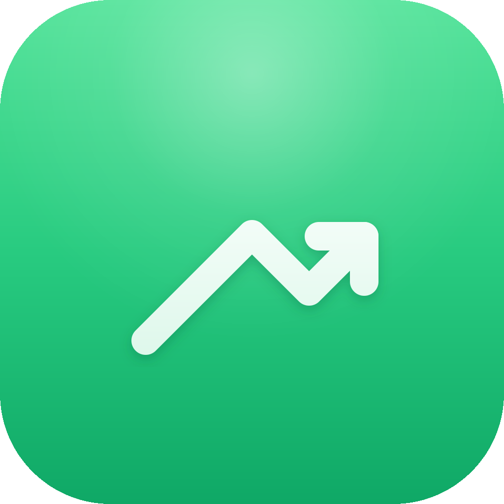

# finctl



[](https://github.com/laurenschristian/finctl/actions/workflows/ci.yml)
[](LICENSE)

One static binary: a CLI and an [MCP](https://modelcontextprotocol.io) server for free market, macro and research data. No cgo, no paid keys for the core.

```console
finctl quote AAPL MSFT           # delayed quote, change, day range (Cboe, Yahoo fallback)
finctl chart NVDA --range 6m     # price history + a sparkline
finctl fund MSFT                 # revenue, capex, shares by fiscal period (SEC XBRL)
finctl capex --quarters 4        # hyperscaler capex, YoY (MSFT/GOOGL/AMZN/META/ORCL)
finctl crypto bitcoin ethereum   # crypto spot (CoinGecko; args are coin ids)
finctl fx USD                    # spot FX from a base (ECB via Frankfurter)

finctl macro brief               # rates, Fed odds, and risk on one screen
finctl rates                     # 3m/2y/10y/30y + 2s10s, 3m10y (Treasury, keyless)
finctl curve                     # full Treasury par yield curve
finctl fedodds                   # market-implied FOMC target-rate odds (Kalshi)
finctl cot --market ES           # CFTC net non-commercial positioning
finctl energy                    # WTI, Brent, natural gas, gasoline (Yahoo)
finctl fiscal                    # US debt to the penny (Treasury FiscalData)
finctl series DGS10 --n 6        # any FRED series (needs FINCTL_FRED_KEY)

finctl tw-revenue                # TWSE monthly revenue, AI-server ODM basket (MoM/YoY)
finctl gpu-rent --trend          # vast.ai H100/B200 $/hr low + median, stored over time

finctl research NVDA             # one-screen dossier (quote, fund, short, options, insider)
finctl lens NVDA                 # Serenity checklist with computable items filled in
finctl short NVDA                # FINRA short interest, days-to-cover (keyless)
finctl options NVDA              # Cboe chain: 30d IV, put/call, max pain, OI walls
finctl filings NVDA --form 8-K   # recent SEC filings
finctl insider NVDA              # recent Form 4 filings
finctl dilution NVDA             # shares-outstanding trend + dilution flag

finctl port                      # IBKR positions vs vault targets, drift (account ids redacted)
finctl watchlist                 # vault watchlist with live price and distance to buy-zone

finctl voices                    # curated market voices from X (followers, bio; fxtwitter)
finctl voice read <url>          # hydrate a single tweet to text

finctl daily                     # morning brief: book, buy-zones, macro, Fed odds, insiders

finctl cache clear               # drop the on-disk cache
finctl doctor                    # config, cache, provider reachability
finctl mcp                       # MCP server over stdio
```

Add `--json` to any command for machine-readable output.

## Install

```console
brew install laurenschristian/tap/finctl
go install github.com/laurenschristian/finctl@latest
```

Or grab a binary from [Releases](https://github.com/laurenschristian/finctl/releases).

## SEC contact User-Agent (required for `fund` and `capex`)

SEC EDGAR rejects requests without a contact in the User-Agent (HTTP 403). Set one once:

```console
export FINCTL_USER_AGENT="finctl/0.1 (you@example.com)"
```

Or put `user_agent: finctl/0.1 (you@example.com)` in the config file. The keyless market commands (`quote`, `chart`, `crypto`, `fx`) work without it.

> `fund` reads SEC XBRL companyfacts and works for off-calendar fiscal-year filers (NVDA, AAPL) too. Rows are labeled by the calendar quarter the fiscal period ended in (CY2026Q2). Cash-flow items (capex) are de-cumulated from year-to-date filings. The fiscal-Q4 quarter has no separate quarterly filing (only the annual 10-K), so it appears as a gap, by design.

## Configure

Precedence is flags, then environment (`FINCTL_USER_AGENT`, `FINCTL_CACHE_DIR`, `FINCTL_CONFIG`), then the config file
(`~/Library/Application Support/finctl/config.yaml` on macOS, `~/.config/finctl/config.yaml` on Linux).
Provider keys are optional and off the keyless path; set them later with `FINCTL_<PROVIDER>_KEY` or a `*_key_cmd` that prints the secret from a keychain, `op read`, `pass` or sops.

## MCP

```console
claude mcp add fin -- finctl mcp
```

Twenty-four tools: `fin_quote`, `fin_chart`, `fin_fund`, `fin_capex`, `fin_crypto`, `fin_fx`, `fin_rates`, `fin_fedodds`, `fin_cot`, `fin_series`, `fin_fiscal`, `fin_energy`, `fin_tw_revenue`, `fin_gpu_rent`, `fin_short`, `fin_options`, `fin_filings`, `fin_insider`, `fin_dilution`, `fin_port`, `fin_watchlist`, `fin_voices`, `fin_voice_read`, `fin_daily`. Any stdio MCP client (Cursor, Claude Desktop, Zed) works the same: command `finctl`, args `["mcp"]`.

## Data sources

- Quotes and charts: Cboe delayed, Yahoo fallback
- Fundamentals and capex: SEC EDGAR XBRL (needs a contact User-Agent)
- Crypto: CoinGecko
- FX: Frankfurter (ECB reference rates)
- Rates and curve: US Treasury par yield curve XML
- Fed odds: Kalshi KXFED prediction markets
- Positioning: CFTC Commitments of Traders (Socrata)
- Fiscal: Treasury FiscalData (debt to the penny)
- Macro series: FRED (free key via `FINCTL_FRED_KEY`)
- Taiwan ODM revenue: TWSE OpenAPI monthly revenue
- GPU rental spot: vast.ai on-demand offers
- Short interest: FINRA consolidated short interest
- Options: Cboe delayed option chains
- Filings and insiders: SEC EDGAR submissions feed (Form 4)
- Portfolio: the local IBKR Client Portal gateway (ibkrctl daemon; account ids redacted)
- Targets and watchlist: your Obsidian vault (read-only markdown tables)

Responses are cached on disk (pure-Go SQLite) with per-provider TTLs and rate limits. See [docs/data-sources.md](docs/data-sources.md) for the full catalog and [PLAN.md](PLAN.md) for the roadmap (macro, filings, portfolio, research).

## Portfolio (port, watchlist)

`port` reuses the IBKR Client Portal gateway that [ibkrctl](https://github.com/laurenschristian/ibkrctl) runs on `localhost:5001`: finctl never logs in. If the session is not authenticated it tells you to run `ibkrctl login`. Account ids and holder names are redacted to `account-1`, `account-2` before anything is printed, exactly like ibkrctl. Target weights and watchlist buy-zones are read from your Obsidian vault (`vault_dir`); finctl never writes the vault. `networth` and `port review` are planned.

## Development

```console
make hooks    # gofmt, dash check, gitleaks, build, lint on commit; tests + coverage floor on push
make test
make cover    # floor in scripts/coverage.sh
make lint     # golangci-lint, config in .golangci.yml
make sec      # gosec
make docs     # regenerate man/ and docs/cli/
```

See [CONTRIBUTING.md](CONTRIBUTING.md). MIT.
